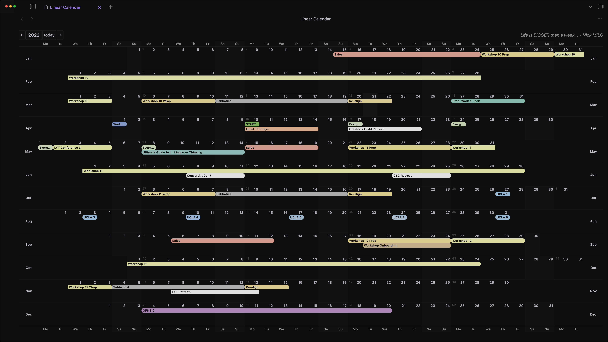
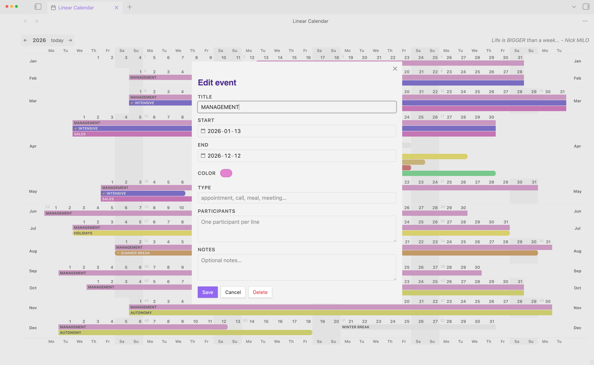

# **Lindar** is under *development*
🚧 Early development — breaking changes may occur

> Yet another yearly linear calendar plugin for Obsidian, designed for long-horizon planning, but:
> • yearly
> • horizontal
> • linear

***Lindar*** is a response to Nick Milo's request — in his video [The Most Useful Calendar View in 2025 That No One Told You About](https://youtu.be/SQHYj7x-t3A&t=702) from his channel [Linking Your Thinking](https://www.youtube.com/@linkingyourthinking).

We'd like to thank him for his approach and his inspiration that guided the visual interface of ***Lindar***.

> ***Our calendar is bigger than a month***
> ***to help you change your perspective and***
> ***challenge your actions***

---
## Documentation

| Topic | |
|---|---|
| Features & event format | [`docs/features.md`](docs/features.md) |
| Development guide | [`docs/development.md`](docs/development.md) |
| Roadmap | [`docs/roadmap.md`](docs/roadmap.md) |
| Design notes | [`docs/design.md`](docs/design.md) |
| Changelog | [`CHANGELOG.md`](CHANGELOG.md) |

---
## Quick start

1. choose your `Events notes folder` in `Settings > Community plugins > Lindar` (default is `yearly-events`)
2. set hotkey for **Lindar: Open**` in `Settings > Hotkeys` (suggested: cmd+Shift+L`)
3. open the `Linear Calendar` tab from the `ribbon` icon or command palette
4. click a date (soon drag across dates) to create an event
5. fill in `TITLE`, date range, color, and optional metadata (`TYPE`, `PARTICIPANTS`, `DESCRIPTION`)
6. on `Save`: the event is written as a Markdown note in your configured events folder
7. `cmd+click`an event to open its related local note

---
### ⭐️ **Roadmap** unlocks with GitHub stars:

- _100 GitHub ⭐_
    - tag-based discovery: display any note tagged #event
    - `List` & `Unscheduled` tabs

- _500 GitHub ⭐_
    - switch to vertical view
    - click on a month title to create an event all through that month
    - same for days: create a recurrent event on a day of the month throughout the year

- _1 000 GitHub ⭐_
    - CalDAV sync
    - two-way sync with remote calendars
    - iCal feed import

---
## License

This project is licensed under the **[MIT License](LICENSE)**.

---

made with ⏳ by <a href="https://github.com/punkyard">punkyard</a>
